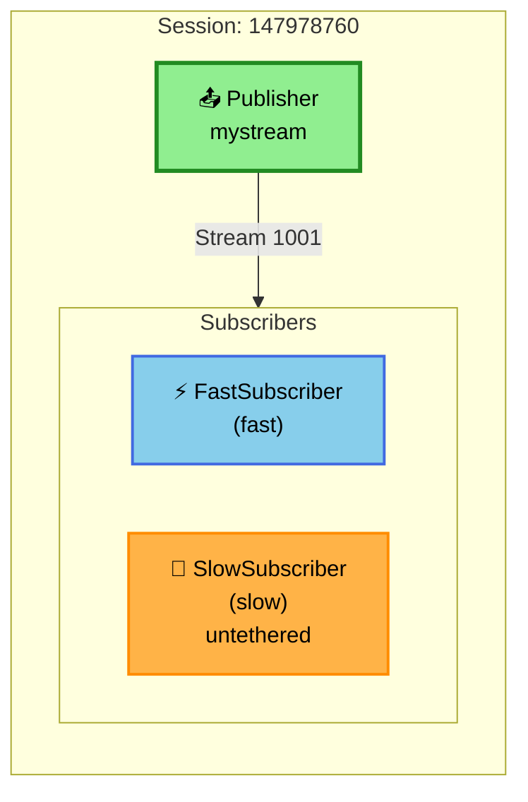

```mermaid
graph LR
    subgraph Session["Session: 147978760"]
        direction TB
        
        Pub["📤 Publisher<br/>mystream"]
        
        subgraph Subscribers["Subscribers"]
            Sub1["⚡ FastSubscriber<br/>(fast)"]
            Sub2["🐌 SlowSubscriber<br/>(slow)<br/>untethered"]
        end
        
        Pub -->|Stream 1001| Subscribers
    end
    
    style Pub fill:#90EE90,stroke:#228B22,color:#000,stroke-width:3px
    style Sub1 fill:#87CEEB,stroke:#4169E1,color:#000,stroke-width:2px
    style Sub2 fill:#FFB347,stroke:#FF8C00,color:#000,stroke-width:2px


```
